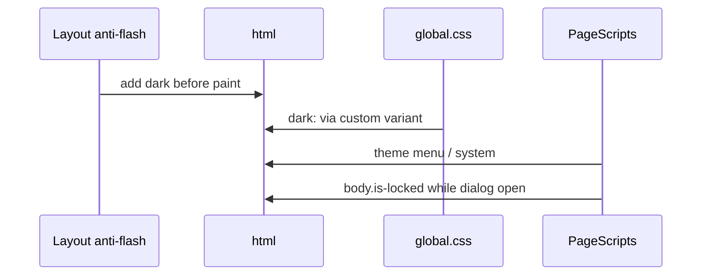

# Design: Adopt Astro Tailwind

**C:** utilities in `.astro`; one `src/styles/global.css` (`@import "tailwindcss"`, `@theme`, class `dark`); leftover CSS only on the allow-list; delete `src/styles/global.scss` and `sass`. Keep `@tailwindcss/vite` in `astro.config.mjs`. Not a redesign. Capability: `astro-tailwind-styling`.

## Architecture Decisions

| Option | Tradeoff | Decision |
|--------|----------|----------|
| C vs A vs B | A brittle JS HTML; B = `@apply`/BEM vs Tailwind v4 | **C** (default; user still reviewing before apply) |
| Drop Sass | SCSS is flat CSS; v4 not for Sass | **Delete SCSS + `sass`** |
| Class vs media `dark:` | Anti-flash + menu use `html.dark` | **`@custom-variant dark (&:where(.dark, .dark *));` then `dark:`** |
| Leftover vs `@apply` | `@apply`-as-system is B | **Leftover `@layer`; `@apply` last resort** |
| Pixel vs rem | Equivalent rem is enough | **Brand/layout match; rem OK** |
| Config timing | Apply would still say BEM | **`styling_convention` at archive only** |

## Data Flow

Preserve `data-*`, ids, ARIA, `is-locked`. Restyle `innerHTML` to allow-listed classes only.

## Leftover CSS allow-list

Only in `src/styles/global.css`. No other named classes.

**`@layer base`:** `html, h1, h2, h3 { font-size-adjust: from-font }`; `[hidden], .booking-field-group[hidden] { display: none !important }`; `body.is-locked { overflow: hidden }`; `@media (prefers-reduced-motion: reduce)` port SCSS 962–971.

**Hard (`@layer components`):** `.section-eyebrow::after` (class stays; color via `text-brand-*`); `.hero__overlay` / `.dark .hero__overlay` gradients (SCSS 382–392); `.dark .site-logo` invert; `.contact__map` grayscale + dark invert/hue-rotate; `.booking-modal::backdrop`; `#bookingForm :user-invalid`; `@keyframes pricing-savings-in` on `.pricing-savings-highlight`.

**Repeated / JS-injected:** `.btn-brand` (`:hover`/`:focus-visible`); `.btn-secondary` (`.dark`) in `Hero.astro` + `Contact.astro`; pricing in `PageScripts.astro`: `.pricing-card__group`, `.pricing-card__group-title`, `.pricing-card__pill-row`, `.pricing-pill`, `.pricing-pill-bono`, `.pricing-pill-active`, `.pricing-compare`, `.pricing-compare-figures`, `.pricing-single`, `.pricing-original`, `.pricing-discounted`, `.pricing-per-session`, `.pricing-savings-highlight`; bonos: `.bonos-example`, `.bonos-example__title`, `.bonos-example__text`, `.bonos-example__prices`.

Not leftover: `pricing-card--reverse` → `lg:flex-row-reverse`. Drop `.page`, `.landing-page`.

## Interfaces / Contracts

`global.css` order: `@import "tailwindcss"` → `@custom-variant dark (&:where(.dark, .dark *));` → `@theme` → leftover `@layer`.

Map every SCSS `:root` `--brand-*` (same set as `astro-migration-context.md`) to `@theme --color-brand-*`. Add `--font-sans` (Noto Sans), `--font-serif` (Noto Serif), `--shadow-soft`. Utilities: `bg-brand-sage`, `font-serif`, `shadow-soft`. Leftover CSS: `var(--color-brand-*)`. Keep `PageScripts.astro` FA theme utilities (`text-amber-500`, `dark:text-amber-300`).

## File Changes

| File | Action | Description |
|------|--------|-------------|
| `src/styles/global.css` | Modify | Sole entry: import, variant, `@theme`, leftover |
| `src/styles/global.scss` | Delete | Unused Sass |
| `package.json` | Modify | Remove `sass` |
| `astro.config.mjs` | Unchanged | Keep `tailwindcss()` plugin |
| `src/layouts/Layout.astro` | Modify | CSS-only import; html/body utilities; keep anti-flash + CDNs |
| `src/pages/index.astro` | Modify | Drop `landing-page` |
| `src/components/Header.astro` | Modify | Utilities; keep ids/ARIA/`data-*` |
| `src/components/Hero.astro` | Modify | Utilities; keep `hero__overlay` |
| `src/components/About.astro` | Modify | Utilities |
| `src/components/Massages.astro` | Modify | Utilities |
| `src/components/PricingCard.astro` | Modify | Utilities; keep `data-pricing-*`; `lg:flex-row-reverse` |
| `src/components/Rituals.astro` | Modify | Utilities; keep `#bonoExamples` |
| `src/components/Contact.astro` | Modify | Utilities; keep `contact__map` |
| `src/components/Footer.astro` | Modify | Utilities; `site-logo` |
| `src/components/MobileBar.astro` | Modify | Utilities; keep `data-open-booking` |
| `src/components/BookingModal.astro` | Modify | Utilities; keep ids/ARIA; `booking-modal` |
| `src/components/PageScripts.astro` | Modify | Injected classes = allow-list; keep `html.dark` + `is-locked` |
| `openspec/config.yaml` | Archive only | Drop SCSS; `styling_convention` → utilities + allow-list |

## Testing Strategy

| Layer | What | Approach |
|-------|------|----------|
| Unit / integration / E2E | N/A | No test runner |
| Visual QA | Brand/layout | Light/dark/system; anti-flash reload; default/`md` 768/`lg` 1024; theme + mobile menus; mobile bar; modal backdrop + `:user-invalid` + hidden ritual fields; pricing pills/savings/reverse; logo+map dark filters; reduced-motion |

## Threat Matrix

N/A — no routing, shell, subprocess, VCS/PR automation, executable-file classification, or process-integration boundary.

## Migration / Rollout

No data migration. Apply on `feat/adopt-astro-tailwind` after user review. 400-line slices: (1) `global.css` + Layout + drop Sass (2) Header/Hero/MobileBar (3) About/Massages/PricingCard/Rituals (4) Contact/Footer/BookingModal (5) PageScripts. Rollback: revert branch; restore dual CSS+SCSS+BEM. Config stays BEM until archive.

## Open Questions

- [ ] C vs A: defaulted to **C**; user still reviewing before apply
- [ ] Pixel vs rem: default rem-aligned if values match
- [ ] Drop Sass: default yes
