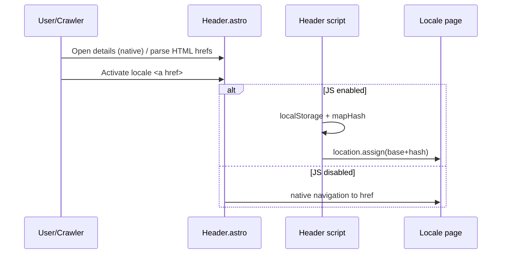

# Design: Crawlable Locale Switcher

## Technical Approach

Confine implementation to `Header.astro` (desktop + drawer lang widgets + inline script). Replace locale **option** `<button role="menuitemradio">` with `<a href={getRelativeLocaleUrl(...)}>`. Keep Layout hreflang/canonical as-is (already `es`→`/`, `en`→`/en/`, `x-default`→ES). Maps proposal + `site-header` MODIFIED language-switcher requirement; respects `site-i18n` routing.

## Architecture Decisions

| Decision | Options | Tradeoff | Choice |
|----------|---------|----------|--------|
| Option element | Keep `button` + JS nav vs `<a href>` | Buttons are not crawlable / no-JS dead | **`<a>`** with `href` from existing `esHrefBase` / `enHrefBase` |
| Href source | Hardcode `/`,`/en/` vs `getRelativeLocaleUrl` | Hardcode drifts from Astro i18n | **Keep `getRelativeLocaleUrl("es"\|"en")`** (already in Header) |
| Disclosure | `button`+`hidden` (JS-only open) vs `<details>`/`<summary>` | JS-only open fails no-JS AC even if options are anchors | **`<details>`/`<summary>`** styled as current lang chrome; both widgets |
| Active state | `menuitemradio`+`aria-checked` vs `aria-current="page"` | Radio implies in-page exclusive set, not navigation | **`aria-current="page"`** on current locale link; check icon via current-page group style |
| Menu roles | Drop roles vs `role="menu"`+`menuitem` on links | Theme widget keeps menu pattern | **Keep `role="menu"`**; options **`role="menuitem"`** (APG link-in-menu); drop radio |
| `data-lang-href` | Keep vs drop | Duplicates `href` | **Drop**; `href` is SoT; keep `data-lang-option` for locale id |
| JS on option click | Remove vs enhance | Hash remap + persist need JS | **Progressive enhance**: `preventDefault` → `localStorage` + `mapHash` → `location.assign(base+hash)`; without JS, bare `href` navigates (hash not remapped) |
| Toggle script | Remove vs adapt | Theme/drawer still call `closeAllLangMenus` | **Adapt**: open/close/`Escape`/outside-click operate on `details.open`; keep `window.__closeAllLangMenus` for PageScripts |
| Same-locale link | Omit current vs keep both anchors | Crawlers need both directions from every page | **Keep both** ES and EN links always |
| Layout.astro | Edit vs verify | Already correct alternates | **Verify only** — no code change |
| Theme widget | Mirror anchors vs leave | Theme is not URL navigation | **Leave buttons** (OOS) |

## Data Flow

```
SSR: getRelativeLocaleUrl(es|en) → <a href> in Header (desktop + drawer)
       │
No-JS: user opens <details> → activates <a> → browser GET `/` or `/en/`
       │
JS:    click <a[data-lang-option]> → store LOCALE_KEY → mapHash → assign base+hash
       │
Layout head (unchanged): canonical + hreflang es/en/x-default match those paths
```



## File Changes

| File | Action | Description |
|------|--------|-------------|
| `src/components/Header.astro` | Modify | Locale widgets → `<details>`/`<summary>` + option `<a>`; adapt lang script; drop `data-lang-href` |
| `src/layouts/Layout.astro` | None | Confirm hreflang/canonical still match `/` and `/en/` |
| `src/components/PageScripts.astro` | None | Continues calling `__closeAllLangMenus` |
| `openspec/specs/site-header/spec.md` | Deferred | Merged on archive from change delta |

## Interfaces / Contracts

```astro
<!-- per option; bases already computed in frontmatter -->
<a
  class={themeOptionClass}
  href={option.value === "en" ? enHrefBase : esHrefBase}
  role="menuitem"
  data-lang-option={option.value}
  aria-current={option.value === locale ? "page" : undefined}
>
```

```js
// enhance only; href remains authoritative
el.addEventListener("click", (e) => {
  e.preventDefault();
  const next = el.dataset.langOption;
  const base = new URL(el.getAttribute("href"), location.origin).pathname;
  localStorage.setItem(LOCALE_KEY, next);
  const mapped = mapHash((location.hash || "").replace(/^#/, ""), next);
  location.assign(`${base}${mapped ? `#${mapped}` : ""}`);
});
```

Close API: `closeAllLangMenus()` sets `details[data-lang-widget] details` / `[data-lang-menu]` host `open=false` (exact selector follows markup) and syncs any leftover ARIA on summary.

## Testing Strategy

| Layer | What to Test | Approach |
|-------|-------------|----------|
| Unit | N/A | No test runner (`strict_tdd: false`) |
| Static/type | Header still typechecks | `npx astro check` |
| Manual | Anchors, no-JS nav, drawer, focus, hreflang | View source + disable JS; open drawer lang; Escape/outside; compare Layout alternates to `href`s |

## Threat Matrix

N/A — no shell, subprocess, VCS/PR automation, executable-file classification, or process-integration boundary. Locale paths reuse existing Astro i18n routes; no new routing surface.

## Migration / Rollout

No migration required. Deploy with Header-only change; rollback = revert Header.

## Open Questions

- [ ] Confirm check-icon CSS: migrate `group-aria-checked` → `aria-current` group selector (or Tailwind `aria-current` variant) during apply — non-blocking
