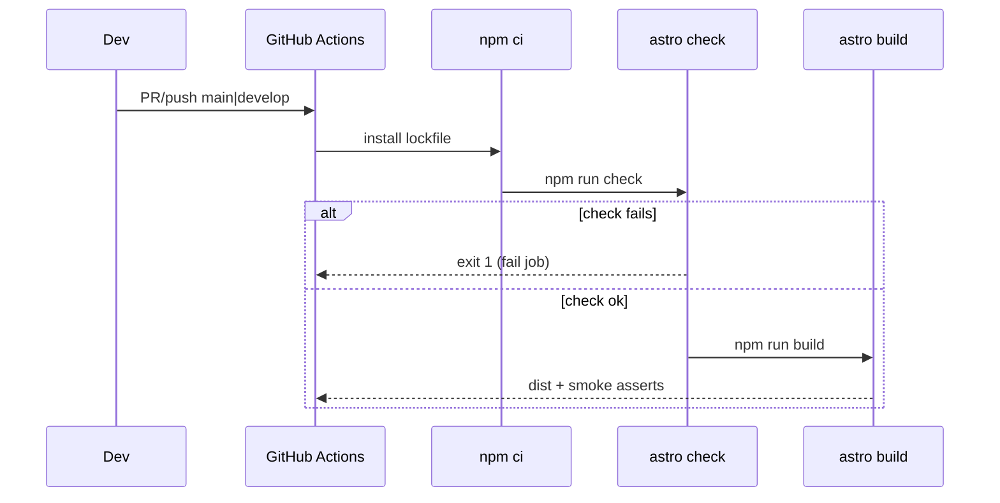

# Design: Fix Astro Check CI

## Technical Approach

Clear the eight `astro check` errors in `AboutStats.astro` by typing the processed client `<script>` (HTMLElement + `number`, no `any`). Add `"check": "astro check"`. Keep `"build": "astro build"` unchanged; CI runs check then build. Maps proposal + `astro-check-ci` ADDED requirements. Baseline (this worktree): 8 errors in AboutStats only; 5 pre-existing hints elsewhere — out of scope unless they fail exit code.

## Architecture Decisions

| Decision | Options | Tradeoff | Choice |
|----------|---------|----------|--------|
| Typing style | Annotate in-place vs extract `.ts` module | Extract adds file + import churn for ~70 LOC | In-place types in `<script>`; match `Massages.astro` / `querySelectorAll<HTMLElement>` |
| DOM/`dataset` | `HTMLElement` params vs `getAttribute` only | `dataset` camelCase already correct once element is `HTMLElement` | `HTMLElement` (+ `null` where needed); `querySelectorAll<HTMLElement>`; guard `querySelector` result with `instanceof HTMLElement` |
| `check` vs `build` | Chain `check && build` vs separate | Chaining slows every local build | Separate scripts; CI sequences both |
| Node in CI | 20 vs 22 | `engines`: `>=22.12.0` | `node-version: "22"` + `cache: npm` |
| CI triggers | PR-only vs PR+push | Push catches direct commits to protected branches | `pull_request` + `push` on `main` and `develop` |
| Workflow name | `ci.yml` vs `astro-check.yml` | Generic name fits future jobs | `.github/workflows/ci.yml` |
| Artifact smoke | Skip vs assert `dist` | Optional in issue; low cost | Include: `dist/robots.txt` + sitemap file under `dist/` (`sitemap-index.xml` or `sitemap-*.xml`) |
| Hints (Header/PageScripts/SeoJsonLd) | Fix now vs ignore | Not errors; expands scope | Ignore for this change |

## Data Flow

```
Developer / PR
    │
    ├─ npm run check ──→ @astrojs/check + tsc (strict) ──→ exit 0|1
    │
    └─ npm run build ──→ dist/ (+ sitemap, robots copy)
              │
CI (GHA): checkout → setup-node 22 → npm ci → check → build → [smoke dist]
```



## File Changes

| File | Action | Description |
|------|--------|-------------|
| `src/components/AboutStats.astro` | Modify | Type script params; narrow DOM/`dataset` |
| `package.json` | Modify | Add `"check": "astro check"`; leave `build` as-is |
| `.github/workflows/ci.yml` | Create | Node 22, `npm ci`, check, build, dist smoke |

## Interfaces / Contracts

Non-obvious typing shape (in-script; no new shared module):

```ts
function easeOutCubic(t: number): number { /* ... */ }
function setStatNumber(el: HTMLElement, value: number): void { /* ... */ }
function animateCount(el: HTMLElement): void {
  const tick = (now: number) => { /* rAF */ };
}
function startStatCount(statValue: HTMLElement | null): void { /* dataset.countStarted */ }
// forEach: querySelectorAll<HTMLElement>(...)
// observer: startStatCount(el instanceof HTMLElement ? el : null) after querySelector
```

Do not rename `data-count-to` / `data-count-delay` attributes.

## Testing Strategy

| Layer | What | Approach |
|-------|------|----------|
| Unit | N/A | No runner (`strict_tdd: false`) |
| Integration | check + build | Local `npm run check` then `npm run build` |
| CI | Gate | Workflow fails on check/build/smoke failure |
| Manual | Count/reveal UX | Smoke AboutStats once on `npm run preview` (behavior unchanged) |

## Threat Matrix

CI introduces a VCS-triggered process boundary; matrix rows for agent git/PR tooling:

| Boundary | Applicability | Design response | Planned RED tests |
|----------|---------------|-----------------|-------------------|
| Documentation-like paths | N/A — workflow runs npm only | — | — |
| Git repository selection | N/A — `actions/checkout` default | — | — |
| Commit state | N/A — no commits from CI | — | — |
| Push state | N/A — no push from CI | — | — |
| PR commands | N/A — workflow reacts to events; does not compose `gh pr` | — | — |

Expected safe behavior: read-only `contents`; no secrets; fail closed on non-zero check/build/smoke.

## Migration / Rollout

No migration. Merge on `fix/astro-check-ci` → PR into `feat/improved-seo` (or target per chain). Single PR; ~80–150 authored lines (within 400 budget).

## Open Questions

- [x] Check-before-build locally? **No** — CI only.
- [x] Include dist smoke? **Yes** — lightweight assert after build.
- [ ] Confirm default branch protection expects checks named from `ci.yml` job id (ops, non-blocking for design).
