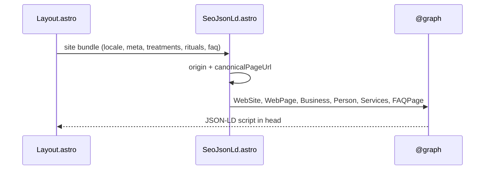

# Design: Stabilize JSON-LD Entity IDs

## Technical Approach

Confine the change to `SeoJsonLd.astro` `@graph` construction. Keep `Astro.site` / `astro.config.mjs` `site` as `https://martaorozcoquiro.netlify.app`. Replace locale-page `@id`s with origin-rooted fragments; add `WebSite`/`WebPage`; stamp services with shared treatment/ritual ids; wire providers via `@id`. Maps proposal + `seo-json-ld` ADDED requirements. NAP/sameAs untouched.

## Architecture Decisions

| Decision | Options | Tradeoff | Choice |
|----------|---------|----------|--------|
| Business/Person `@id` | Locale `pageUrl#…` vs origin `/#…` | Locale IDs split one entity across ES/EN | `${origin}/#business`, `${origin}/#person` via `new URL("/#…", siteOrigin).href` |
| Business/Person `url` | Locale page vs default home | Locale `url` still implies per-page entity | Default home `${origin}/` for both |
| WebSite `@id` | Per-locale vs one site | One site entity | `${origin}/#website`; `url` = `${origin}/`; `publisher` → business |
| WebSite `inLanguage` | Per-page only vs both | Site is bilingual | `["es-ES","en-GB"]` (sitemap i18n) |
| WebPage `@id` | Origin-only vs page URL | Pages are distinct | `${canonicalPageUrl}#webpage`; `isPartOf` → website; `about` → business |
| Page URL source | `Astro.url.pathname` vs `getRelativeLocaleUrl` | Must match Layout canonical | Same as Layout: `getRelativeLocaleUrl(locale)` + `siteOrigin` |
| `inLanguage` codes | `meta.lang` (`es`) vs sitemap BCP-47 | OG uses `_`; schema wants `-` | `es-ES` / `en-GB` (not `meta.lang`) |
| Service `@id` | Hash name vs shared `id` | Shared ids already stable | `${origin}/#service-${id}` (e.g. `#service-descontracturante`, `#service-ritual-desconexion`) |
| Service `url` | Section hash vs omit | No landing pages (OOS) | Omit `url` |
| Provider | Inline name vs `@id` | Inline duplicates business | `provider: { "@id": businessId }` |
| Offers | Add `offeredBy` vs provider only | Extra noise | Keep AggregateOffer/Offer; no `offeredBy` |
| FAQPage link | Orphan vs `isPartOf` WebPage | Helps page graph | `@id` = `${canonicalPageUrl}#faq`; `isPartOf` → webpage; WebPage `mainEntity` → business |
| Layout / config | Touch vs leave | Site already correct | Modify only `SeoJsonLd.astro` |
| NAP / maps | Update alternate Maps link vs freeze | Street/phone/geo/hours/#12 | NAP values + short-link sameAs unchanged; additive Place ID `hasMap` allowed (user override) |
| Place ID hasMap | Omit vs Place-ID Maps URL | Stable Maps identity without rewriting NAP | `hasMap: https://www.google.com/maps/place/?q=place_id:ChIJE7KlJmBtEg0Rn-RGXchxER0` on business (SeoJsonLd-only constant) |

## Data Flow

```
getSite(locale) → Layout → SeoJsonLd
                           │
                           ├─ siteOrigin (Astro.site)
                           ├─ canonicalPageUrl (getRelativeLocaleUrl)
                           ├─ entityIds = origin/#business|#person|#website|#service-*
                           └─ @graph → <script type="application/ld+json">
```



## File Changes

| File | Action | Description |
|------|--------|-------------|
| `src/components/SeoJsonLd.astro` | Modify | Stable IDs; WebSite/WebPage; service ids; provider `@id`; FAQ `@id`+`isPartOf` |
| `src/layouts/Layout.astro` | None | Already includes `<SeoJsonLd />` |
| `astro.config.mjs` | None | `site` + sitemap i18n already correct |

## Interfaces / Contracts

```ts
const siteOrigin = Astro.site ?? new URL("https://martaorozcoquiro.netlify.app");
const origin = siteOrigin.origin; // https://martaorozcoquiro.netlify.app
const canonicalPageUrl = new URL(getRelativeLocaleUrl(locale), siteOrigin).href;
const businessId = new URL("/#business", siteOrigin).href;
const personId = new URL("/#person", siteOrigin).href;
const websiteId = new URL("/#website", siteOrigin).href;
const webpageId = `${canonicalPageUrl}#webpage`;
const serviceId = (id: string) => new URL(`/#service-${id}`, siteOrigin).href;
const inLanguage = locale === "es" ? "es-ES" : "en-GB";
```

Exact ID patterns (production origin):

| Entity | `@id` |
|--------|--------|
| Business | `https://martaorozcoquiro.netlify.app/#business` |
| Person | `https://martaorozcoquiro.netlify.app/#person` |
| WebSite | `https://martaorozcoquiro.netlify.app/#website` |
| WebPage ES | `https://martaorozcoquiro.netlify.app/#webpage` |
| WebPage EN | `https://martaorozcoquiro.netlify.app/en/#webpage` |
| Service | `https://martaorozcoquiro.netlify.app/#service-{id}` |
| FAQPage | `{canonicalPageUrl}#faq` |

WebSite: `@type WebSite`, `url` origin `/`, `inLanguage` both, `publisher` → business.  
WebPage: `@type WebPage`, `url` canonical, `name`/`description` from meta, `inLanguage` page, `isPartOf` → website, `about`/`mainEntity` → business.

## Testing Strategy

| Layer | What | Approach |
|-------|------|----------|
| Unit | N/A | `strict_tdd: false`; no runner |
| Build smoke | Stable IDs in `dist` | After `npm run build`, assert both locale HTML contain `/#business` and `/#person` (not `/en/#business`) |
| Manual | Rich results | Google Rich Results Test + Schema.org validator on `/` and `/en/` |

## Threat Matrix

N/A — no routing, shell, subprocess, VCS/PR automation, executable-file classification, or process-integration boundary.

## Migration / Rollout

No migration. Single PR on `feat/improved-seo` (~40–80 authored lines). External caches may take time to refresh entity graphs after deploy.

## Open Questions

- [x] FAQPage linkage? **Yes** — `#faq` + `isPartOf` webpage; `mainEntity` stays business.
- [x] Service URLs? **Omit** — no landing pages.
- [x] Place ID → `hasMap`? **Yes** (user override during apply) — Google Place ID `ChIJE7KlJmBtEg0Rn-RGXchxER0` as `hasMap` URL; keep existing goo.gl short links in `sameAs`; do not rewrite street/phone/geo/hours.
